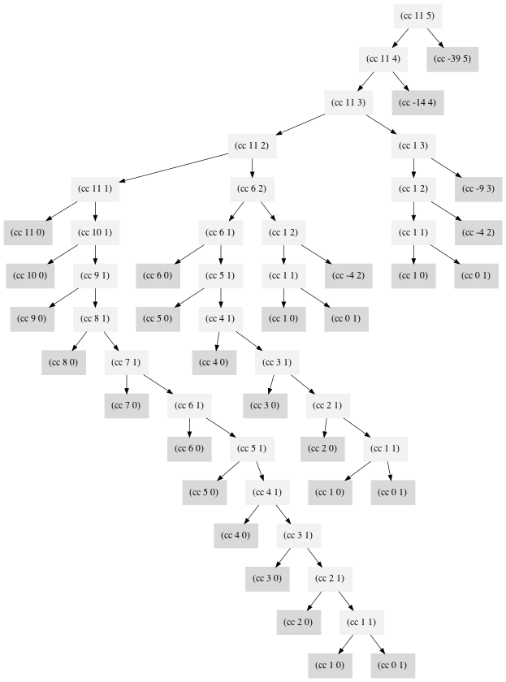

# Review of Structure and Interpretation of Computer Programs

My review of the awesome SICP book.

> I think that it's extraordinarily important that we in computer science **keep fun** in computing.
> --- Alan J. Perlis


Useful links:

- [Mit Scheme Reference](https://www.gnu.org/software/mit-scheme/documentation/stable/mit-scheme-ref.pdf)
- [Mit Scheme User's Manual](https://www.gnu.org/software/mit-scheme/documentation/stable/mit-scheme-user.pdf)

TOC:

- [Setup](#setup)
  - [Sublime Text](#sublime-text)
  - [VS Code](#vs-code)
  - [Chrome](#chrome)
- [Chapter 1: Building Abstractions with Procedures](#chapter-1-building-abstractions-with-procedures)
  - [1.1: The Elements of Programming](#11-the-elements-of-programming)
  - [1.2: Procedures and the Processes They Generate](#12-procedures-and-the-processes-they-generate)
  - [1.3: Formulating Abstractions with Higher-Order Procedures](#13-formulating-abstractions-with-higher-order-procedures)
- [Exercise](#exercise)
  - [1.1](#11)
  - [1.2](#12)
  - [1.3](#13)
  - [1.4](#14)
  - [1.5](#15)
  - [1.6](#16)
  - [1.7](#17)
  - [1.8](#18)
  - [1.9](#19)
  - [1.10](#110)
  - [1.11](#111)
  - [1.12](#112)
  - [1.13](#113)
  - [1.14](#114)
  - [1.15](#115)
  - [1.16](#116)
  - [1.17](#117)
  - [1.18](#118)
  - [1.19](#119)
  - [1.20](#120)
  - [1.21](#121)
  - [1.22](#122)
  - [1.23](#123)
  - [1.24](#124)
  - [1.25](#125)
  - [1.26](#126)
  - [1.27](#127)
  - [1.28](#128)
  - [1.29](#129)
  - [1.30](#130)
  - [1.31](#131)
  - [1.32](#132)
  - [1.33](#133)
  - [1.34](#134)
  - [1.35](#135)
  - [1.36](#136)
  - [1.37](#137)
  - [1.38](#138)
  - [1.39](#139)
  - [1.40](#140)
  - [1.41](#141)
  - [1.42](#142)
  - [1.43](#143)
  - [1.44](#144)
  - [1.45](#145)
  - [1.46](#146)

## Setup

- `mit-scheme`: MIT/GNU Scheme 12.1

For Mac OS

```bash
brew install mit-scheme
brew install rlwrap
cp REPO/scheme-completion.txt ~/scheme-completion.txt
echo 'alias sicp="rlwrap -r -c -f ~/scheme-completion.txt mit-scheme"' >> ~/.zshrc
```

### Sublime Text

Configure the build system:

```json
{
  "shell_cmd": "run-mit-scheme $file",
  "file_regex": "^[ ]*File \"(...*?)\", line ([0-9]*)",
  "selector": "source.scheme"
}
```

I wrap `mit-scheme` program in `run-mit-scheme` script to append trailing new line so that the build result looks better in https://packagecontrol.io/packages/BuildX[BuildX].

```bash
$ cat run-mit-scheme
#!/bin/bash
result=$(mit-scheme --quiet < $1)
code=$?

echo "$result"
exit $code
```

### VS Code

`.vscode/tasks.json` file defines a task to run scheme file.

```json
{
  "version": "2.0.0",
  "tasks": [
    {
      "label": "Run Current File",
      "type": "shell",
      "command": "mit-scheme --quiet < ${file}",
      "group": {
        "kind": "build",
        "isDefault": true
      },
      "options": {
        "cwd": "${fileDirname}"
      },
      "presentation": {
        "echo": true,
        "reveal": "always",
        "panel": "shared",
        "showReuseMessage": false,
        "clear": true
      }
    }
  ]
}
```

Add following keybinding to make it more convenient.

```json
{
    "key": "ctrl+b",
    "command": "workbench.action.tasks.runTask",
    "args": "Run Current File"
}
```

### Chrome

Install [Markdown Viewer](https://chromewebstore.google.com/detail/markdown-viewer/ckkdlimhmcjmikdlpkmbgfkaikojcbjk) plugin to preview this file in Chrome.

## Chapter 1: Building Abstractions with Procedures

- Lisp is so old and also so good.
  - > Lisp was invented in the late 1950s as a formalism for reasoning about the use of certain kinds of logical expressions, called *recursion equations*, as a model for computation. The language was conceived by John McCarthy and is based on his paper “Recursive Functions of Symbolic Expressions and Their Computation by Machine”.
  > --- page3
- Why use Lisp in this book?
  - > If Lisp is not a mainstream language, why are we using it as the framework for our discussion of programming? Because the language possesses unique features that make it an excellent medium for studying important programming constructs and data structures and for relating them to the linguistic features that support them. The most significant of these features is the fact that Lisp descriptions of processes, called procedures, can themselves be represented and manipulated as Lisp data.
  > --- page5

### 1.1: The Elements of Programming

- One of the key features of every programming language is **how to combine simple ideas to form more complex ideas**.
  - >Every powerful language has three mechanisms for accomplishing this:
  >
  >* *primitive expressions*, which represent the simplest entities the language is concerned with,
  >* *means of combination*, by which compound elements are built from simpler ones, and
  >* *means of abstraction*, by which compound elements can be named and manipulated as units.
  > --- page6
- In Lisp, every expression has a value.
- Name matters.
  - >A critical aspect of a programming language is the means it provides for using names to refer to computational objects.
  > --- page10
- Some expressions do not follow general evaluation rule. They are special so they are called `special forms`, like `(define x 1)`.
  - >Such exceptions to the general evaluation rule are called special forms. ... Each special form has its own evaluation rule. The various kinds of expressions (each with its associated evaluation rule) constitute the syntax of the programming language.
  > --- page14
- Lisp has a very simple syntax.
  - > In comparison with most other programming languages, Lisp has a very simple syntax; that is, the evaluation rule for expressions can be described by a simple general rule together with specialized rules for a small number of special forms.
  > --- page15
- Applicative order versus normal order.
  - > This alternative “fully expand and then reduce” evaluation is known as normal-order evaluation , in contrast to the “evaluate the arguments and then apply” method that the interpreter actually uses, which is called applicative-order evaluation.
  > --- page21
- Lisp *uses applicative-order evaluation*.
  - > Lisp uses applicative-order evaluation, partly because of the additional efficiency obtained from avoiding multiple evaluations of expres- sions ... and, more significantly, because normal-order evaluation becomes much more complicated to deal with when we leave the realm of procedures that can be modeled by substitution. On the other hand, normal-order evaluation can be an extremely valuable tool.
  > --- page21
  - Normal order evaluation can be an extremely valuable tool.
- Use `cond` special form to handle conditional expressions.
  - There are two constants `#t` and `#f` in Scheme.
  - Scheme interprets `#f` as false and any other value is treated as true, Providing `#t` is logically unnecessary, but it's convenident.
  - `if` special form is a restricted type of `cond`
- How to compute square roots?
  - > How does one compute square roots? Thee most common way is to use Newton’s method of successive approximations, which says that whenever we have a guess y for the value of the square root of a number x , we can perform a simple manipulation to get a better guess (one closer to the actual square root) by averaging y with x/y.
  > --- page29
  - NOTE: MIT Scheme, however, distinguishes between exact integers and decimal values, and dividing two integers produces a rational number rather than a decimal.
  - [sqrt.scm](./chapter-1/1.1/sqrt.scm)
- We can define functions inside functions.
  - > we allow a procedure to have internal definitions that are local to that procedure. Such nesting of definitions, called block structure, is basically the right solution to the simplest name-packaging problem.
  > --- page38
- What is *lexical scoping*?
  - > Lexical scoping dictates that free variables in a procedure are taken to refer to bindings made by enclosing procedure definitions; that is, they are looked up in the environment in which the procedure was defined.
  > --- page39

### 1.2: Procedures and the Processes They Generate

- A typical recursive process to compute factorial
  ```scheme
  (define (factorial n)
    (if (= n 1)
        1
        (* n (factorial (- n 1)))))

  (factorial 6)
  (* 6 (factorial 5))
  (* 6 (* 5 (factorial 4)))
  (* 6 (* 5 (* 4 (factorial 3))))
  (* 6 (* 5 (* 4 (* 3 (factorial 2)))))
  (* 6 (* 5 (* 4 (* 3 (* 2 (factorial 1))))))
  (* 6 (* 5 (* 4 (* 3 (* 2 1)))))
  (* 6 (* 5 (* 4 (* 3 2))))
  (* 6 (* 5 (* 4 6)))
  (* 6 (* 5 24))
  (* 6 120)
  ; A linear recursion
  ```
  - > This type of process, characterized by a chain of deferred operations, is called a *recursive process*. Carrying out this process requires that the interpreter keep track of the operations to be performed later on.
  > ---page 44
- Iterative process for computing factorial
  ```scheme
  (define (factorial n)
    (define (fact-iter product counter max-count)
      (if (> counter max-count)
          product
          (fact-iter (* product counter) (+ counter 1) max-count)))
    (fact-iter 1 1 n))

  (factorial 6)
  (fact-iter 1 1 6)
  (fact-iter 1 2 6)
  (fact-iter 2 3 6)
  (fact-iter 6 4 6)
  (fact-iter 24 5 6)
  (fact-iter 120 6 6)
  (fact-iter 720 7 6)
  ```
  - > By contrast, the second process does not grow and shrink. At each step, all we need to keep track of, for any n, are the current values of the variables `product`, `counter`, and `max-count`. We call this an *iterative process*.
  > --- page44
- The essential feature of _iterative process_ is that *its state can be summarized by a fixed number of state variables*.
  - > In general, an iterative process is one whose state can be summarized by a fixed number of state variables, together with a fixed rule that describes how the state variables should be updated as the process moves from state to state and an (optional) end test that specifies conditions under which the process should terminate.
  > --- page44
- Pay attention that a recursive *process* is not the same as a recursive *procedure*. We can use a skill called *Tail Call Optimization* to get an iterative process of a recursive procedure.
  - In my understanding, process is the running entity and procedure is the static code.
  - > When we describe a procedure as recursive, we are referring to the syntactic fact that the procedure definition refers (either directly or indirectly) to the procedure itself. But when we describe a process as following a pattern that is, say, linearly recursive, we are speaking about how the process evolves, not about the syntax of how a procedure is written.
  > --- page45
- Calculating fibonacci is a typical *tree recursive* process
  - > In general, the number of steps required by a tree-recursive process will be proportional to the number of nodes in the tree, while the space required will be proportional to the maximum depth of the tree.
  > --- page49
- How many different ways can we make change of $1.00, given half-dollars, quarters, dimes, nickels, and pennies?
  - This problem has a simple solution as a [recursive procedure](./chapter-1/1.2/count-change.scm).
  - It's not obvious how to transform this to an iterative process. I managed to come up with [one](./chapter-1/1.2/count-change-iter.scm), but I have to say it's hard to understand.
  - > A tree-recursive process may be highly inefficient but often easy to specify and understand
  > --- page53
- We can use *memoization* to dramatically reduce time and space usage of tree-recursive process
- _Order of growth_ is a convenient way to express how many resources a process needs.
  - > Let `n` be a parameter that measures the size of the problem, and let `R(n)` be the amount of resources the process requires for a problem of size `n`.
  > ...
  > We say that `R(n)` has order of growth `Θ(f(n))`, written `R(n) = Θ(f(n))` (pronounced “theta of f(n)”), if there are positive constants `k1` and `k2` independent of `n` such that `k1f(n) ≤ R(n) ≤ k2f(n)` for any sufficiently largevalueofn.(In other words, for large `n`, the value `R(n)` is sandwiched between `k1f(n)` and `k2f(n)`.)
  > --- page55
- _Order of growth_ provides only a *rough idea*.
  - > Orders of growth provide only a crude description of the behavior of a process. For example, a process requiring n^2 steps and a process requiring 1000n^2 steps and a process requiring 3n^2 + 10n + 17 steps all have O(n^2) order of growth.
  > --- page56
  - But it still can be very useful.
    - > On the other hand, order of growth provides a useful indication of how we may expect the behavior of the process to change as we change the size of the problem.
    > ---page56
- We can compute exponentials in fewer steps by using successive squaring, check [fast-expt.scm](./chapter-1/1.2/fast-expt.scm)
- There is a famous and efficient algorithm for computing Greated Common Divisor(GCD)
  - based on the observation that: if `r` is the remainder when `a` is divided by `b`, then the common divisors of a and b are precisely the same as the common divisors of b and r.
- Testing for primality
  - A basic one, search for the smallest divisor and n is a prime only if n is its own smallest divisor, check [code](./chapter-1/1.2/prime.scm).
    - This basic primality test is based on the fact that if `n` is not prime it must have a divisor less than or equal to `√n`. Consequently, the number of steps required to identify `n` as prime will have order of growth `Θ(√n)`.
  - There is a Θ(log n) test called _the Fermat test_ which is based on a result from number theory known as _Fermat's Little Theorem_, check [fast-prime.scm](./chapter-1/1.2/fast-prime.scm).
    - *Fermat’s Little Theorem*: If n is a prime number and a is any positive integer less than n, then a raised to the nth power is congruent to a modulo n.
    - The core procedure of the Fermat test is one that computes the exponential of a number modulo another number.
  - The Fermat test has a significant difference from most familiar algorithms, it is a **probabilistic algorithm** and the result is not guaranteed to be correct. But that doesn't mean it is not useful.
    - > The Fermat test differs in character from most familiar algorithms, in which one computes an answer that is guaranteed to be correct. Here, the answer obtained is only probably correct. More precisely, if n ever fails the Fermat test, we can be certain that n is not prime. But the fact that n passes the test, while an extremely strong indication, is still not a guarantee that n is prime. What we would like to say is that for any number n, if we perform the test enough times and find that n always passes the test, then the probability of error in our primality test can be made as small as we like.
    >
    > Unfortunately, this assertion is not quite correct. There **do exist** numbers that fool the Fermat test: numbers n that are not prime and yet have the property that a^n is congruent to a modulo n for all integers a < n. Such numbers are extremely rare, so the Fermat test is quite reliable in practice.
    >
    > There are *variations of the Fermat test* that cannot be fooled.
    > --- page69
  - Numbers that fool the Fermat test are called _Carmichael numbers_, and little is known about them other than that they are extremely rare, so the Fermat test is quite reliable in practice. There are 255 Carmichael numbers below 100,000,000. The smallest few are 561, 1105, 1729, 2465, 2821, and 6601.

### 1.3: Formulating Abstractions with Higher-Order Procedures

- Procedures that manipulate procedures are called **higher-order procedures**.
- Procedures as Arguments
  - We can write a general [sum](./chapter-1/1.3/sum.scm) to express the concept of summation itself rather than particular sums.
  - `sum` and `product` are both special cases of a still more general notion called `accumulate`
- Constructing Procedures Using `Lambda`
  - In general, `lambda` is used to create procedures in the same way as `define`, except that no name is specified for the procedure
  - A `let` expression is simply syntactic sugar for the underlying lambda application
- Procedures as General Methods
  - [Half-interval method](./chapter-1/1.3/half-interval.scm)
    - > The half-interval method is a simple but powerful technique for finding roots of an equation `f(x) = 0`, where f is a continuous function.
    > --- page67
  - [Fixed points](./chapter-1/1.3/fixed-point.scm)
    - > A number x is called a *fixed point* of a function f if x satisfies the equation f(x) = x. For some functions f we can locate a fixed point by beginning with an initial guess and applying f repeatedly.
    > --- page68
    - Finded square root y of number x equals to finding a fixed point of the function `y = x/y`
      - But the naive search does not converge, we need to use a technique called **average damping** to transform the function to be `y = 1/2(y + x/y)`, and this is the Newton's method.
- Procedures as Returned Values
  - Previous square-root procedure is a special case of [Newton's method](./chapter-1/1.3/sqrt-with-newtons-method.scm)
    - > If g(x) is a differentiable function, then a solution of the equation g(x) = 0 is a fixed point of the function f(x) = x - g(x)/Dg(x)

## Exercise

### 1.1

The best way to know what result is printed by the interpreter is to actually type the expression to the interpreter.

### 1.2

We can clearly see the benefits of the syntax of Lisp. It's so concise yet powerful.

[1.2.scm](./chapter-1/1.1/1.2.scm)

### 1.3

[1.3.scm](./chapter-1/1.1/1.3.scm)

### 1.4

```scheme
(define (a-plus-abs-b a b)
  ((if (> b 0) + -) a b))
```

In this function, the operator itself is a subexpression `(if (> b 0) + -)`. It is either built-in procedure `+` or built-in procedure `-` based on the value of `b`.

In Lisp, operator and operands can be any complex expressions.

### 1.5

```scheme
(define (p) (p))

(define (test x y)
  (if (= x 0) 0 y))

(test 0 (p))
```

In normal-order evaluator, the program would run normally, return 0. But in applicative-order evaluator, the program would hang forever.

Because in application-order evaluator, when it evaluates `(test 0 (p))`, it will need to evaluate `(p)` first.

`p` is a procedure which calls itself. So to evaluate `(p)`, we get `(p)` again, and we evaluate that, we get it again, so on and so forth, we can never get a result.

But in normal-order evaluator, it won't evaluate operands until it has to. So `(test 0 (p))` becomes `(if (= 0 0) 0 (p)`. Because `(= 0 0)` is true, it will never evaluate `(p)`.

### 1.6

The procedure would hang forever because it continuously evaluates `sqrt-iter`.

### 1.7

For small numbers, the result will be inaccurate. Let's say we need to iterate 10 times to find the square root of number x, because x is very small, the first time iterated value and x can satisfy the `good-enough?` condition.

```scheme
(display (square (sqrt 1e-5)))
; 9.832294718753643e-4
; clearly inaccurate sqrt
```

For big numbers, the program will run forever. We can never find a guess to satisfy the condition because we only have limited precision.

```scheme
; CAUTION! this function will run forever
(display (sqrt 1.797693134862315708145274237317043567981e+308))
```

Does it help with the new `good-enough?` implementation? Of course!

Check new implementation at [1.7.scm](./chapter-1/1.1/1.7.scm)

### 1.8

[1.8.scm](./chapter-1/1.1/1.8.scm)

### 1.9

```scheme
(define (+ a b)
  (if (= a 0) b (inc (+ (dec a) b))))

(+ 4 5)
;(inc (+ 3 5))
;(inc (inc (+ 2 5)))
;(inc (inc (inc (+ 1 5))))
;(inc (inc (inc (inc (+ 0 5)))))
;(inc (inc (inc (inc 5))))
;(inc (inc (inc 6)))
;(inc (inc 7))
;(inc 8)
9

; this is a recursive process.
```

```scheme
(define (+ a b)
  (if (= a 0) b (+ (dec a) (inc b))))

(+ 4 5)
;(+ 3 6)
;(+ 2 7)
;(+ 1 8)
;(+ 0 9)
9

; this is an iterative process.
```

### 1.10

[1.10.scm](./chapter-1/1.2/1.10.scm)

### 1.11

The recursive version is very easy, just follow the formula.

Because this function is a slight modification of `fibonacci`, we can use the same skill to construct the iterative function.

[1.11.scm](./chapter-1/1.2/1.11.scm)

### 1.12

It's obvious that `f(row, index) = f(row-1, index-1) + f(row-1, index)`.

[1.12.scm](./chapter-1/1.2/1.12.scm)

### 1.13

Let's first prove that

$$
Fib(n) =  \frac{\phi^{n} - \psi^{n}}{\sqrt{5}} \\
$$

Given

$$
\begin{gathered}
\phi = \frac{1 + \sqrt{5}}{2} \\
\psi = \frac{1 - \sqrt{5}}{2} \\
Fib(n) = Fib(n)  + Fib(n-1)
\end{gathered}
$$

If

$$
\begin{align}
Fib(n) &= \frac{\phi^n - \psi^n}{\sqrt{5}} \\
Fib(n-1) &= \frac{\phi^{n-1} - \psi^{n-1}}{\sqrt{5}} \\
\end{align}
$$

Because

$$
\begin{align}
\phi\psi = -1 \\
\phi + \psi = 1 \\
\end{align}
$$

We can get

$$
\begin{align}
\phi^{n+1} - \psi^{n+1} & = \phi\phi^n - \psi\psi^{n} \\
& = (1 - \psi)\phi^n - (1 - \phi)\psi^n \\
& = \phi^n - \psi\phi^n - \psi^n + \phi\psi^n \\
& = \phi^n - \psi\phi\phi^{n-1} - \psi^n + \phi\psi\psi^{n-1} \\
& = \phi^n - \psi^n + \phi^{n-1} - \psi^{n-1} \\
\\
Fib(n+1) & = Fib(n) + Fib(n-1) \\
& = \frac{\phi^n - \psi^n + \phi^{n-1} - \psi^{n-1}}{\sqrt{5}} \\
& = \frac{\phi^{n+1} - \psi^{n+1}}{\sqrt{5}}
\end{align}
$$

To prove that $Fib(n)$ is the closest integer to $\frac{\phi^{n}}{\sqrt{5}}$, All we have to do is to prove that

$$
\begin{align}
\left| Fib(n) - \frac{\phi^n}{\sqrt{5}} \right| < \frac{1}{2} \\
\left| \frac{\phi^n}{\sqrt{5}} - \frac{\psi^n}{\sqrt{5}} - \frac{\phi^n}{\sqrt{5}} \right| < \frac{1}{2} \\
\left| \frac{\psi^n}{\sqrt{5}} \right| < \frac{1}{2} \\
\left| \frac{\psi^n}{\sqrt{5}} \right| < \frac{1}{2} \\
\left| \psi^n \right| < \frac{\sqrt{5}}{2} \\
(\frac{\sqrt{5} - 1}{2})^n < \frac{\sqrt{5}}{2}
\end{align}
$$

Because $\sqrt{5} > 2$, so all we have to prove is

$$
(\frac{\sqrt{5} - 1}{2})^n <= 1
$$

Because $0 < \frac{\sqrt{5} - 1}{2} < 1$, so based on the properties of exponential functions, the above is true.

### 1.14

The image below is generated by [a python script](./chapter-1/1.2/1.14.py) with Graphviz, dark node is the leaf node.



The space complexity is the depth of the tree, and we can see that is `Θ(amount)`.

The time complexity is hard to analyze. The result is `cc(amount, kind) = Θ(amount^kind)`. Here is a [detail explaination](https://codology.net/post/sicp-solution-exercise-1-14/).

### 1.15

For question a:

We need to get sine's argument down to 0.1 by dividing 12.15 by 121.5 or greater number. Every time `p` is applied, argument gets divided by 3. How many times we need to divide 12.15 by 3 to get down to 0.1? We need to find out the x from x^3 = 121.5.

```scheme
; 3^x = 121.5
; x = log(121.5) / log(3)
(display (/ (log 121.5) (log 3))) ; 4.37
; So p will be applied 5 times.
```

For question b:

Space and time complexity of `(sine a)` are both `Θ(log3 a)`.

### 1.16

[1.16.scm](./chapter-1/1.2/1.16.scm)

### 1.17

[1.17.scm](./chapter-1/1.2/1.17.scm)

### 1.18

[1.18.scm](./chapter-1/1.2/1.18.scm)

### 1.19

```
p' = p^2 + q^2
q' = q^2 + 2pq
```

Applying T(p,q) twice equals to applying T(p', q') once, this is a wonderful property and we can use this to calculate Fibonacci logarithmically.

Check the [full code](./chapter-1/1.2/1.19.scm).

### 1.20

Applicative order:

```scheme
(gcd 206,40)
+1 -> (gcd 40, 6)
+1 -> (gcd 6, 4)
+1 -> (gcd 4, 2)
+1 -> (gcd 2, 0)
-> result
```

4 times.

Normal order:

```scheme
(gcd 206 40)
(gcd 40 (remainder 206 40))
+1 (gcd (remainder 206 40) (remainder 40 (remainder 206 40)))
+2 (gcd (remainder 40 (remainder 206 40)) (remainder (remainder 206 40) (remainder 40 (remainder 206 40))))
+4 (gcd
    (remainder (remainder 206 40) (remainder 40 (remainder 206 40)))
    (remainder
      (remainder 40 (remainder 206 40))
      (remainder (remainder 206 40) (remainder 40 (remainder 206 40)))))
+7 (remainder (remainder 206 40) (remainder 40 (remainder 206 40)))
+4 -> result
```

18 times!

### 1.21

`smallest-divisor` function is in this [file](./chapter-1/1.2/prime.scm).

- `(smallest-divisor 199)`: 199
- `(smallest-divisor 1999)`: 1999
- `(smallest-divisor 19999)`: 7

### 1.22

- Use `real-time-clock` instead of `runtime` because `runtime` returns seconds which is too big to observe.
- Computers have become so fast, to get meaningful results, we need to test with very large numbers.

[](./chapter-1/1.2/1.22.scm).

```
1000003.***2
1000033.***2
1000037.***2

10000019.***5
10000079.***5
10000103.***5

100000007.***16
100000037.***15
100000039.***14

1000000007.***44
1000000009.***44
1000000021.***44
```

We can see that the timing data basically corresponds to Θ(√n). The more bigger n gets, the better support for the Θ(√n) prediction.

### 1.23

[1.23.scm](./chapter-1/1.2/1.23.scm).

```
1000003.***1
1000033.***1
1000037.***1

10000019.***3
10000079.***3
10000103.***3

100000007.***10
100000037.***8
100000039.***8

1000000007.***24
1000000009.***25
1000000021.***24
```

We can see that the process runs basically twice as fast as exercise 1.22, so the expectation is confirmed.

### 1.24

* `1e20` notation produces a float number, we need to use `floor->exact` to convert it to an integer. Otherwise `remainder` procedure will error out.
* We need to use very large numbers to observe logarithmic growth.

[1.24.scm](./chapter-1/1.2/1.24.scm).


```
; 1e20
100000000000000000039***14
100000000000000000129***12
100000000000000000151***12

; 1e40
10000000000000000303786028427003666890753***23
10000000000000000303786028427003666891041***23
10000000000000000303786028427003666891101***24

; 1e80
100000000000000000026609864708367276537402401181200809098131977453489758916313173***52
100000000000000000026609864708367276537402401181200809098131977453489758916313209***54
100000000000000000026609864708367276537402401181200809098131977453489758916313233***53
```

We can see that the running time of `1e80` is roughly twice as `1e40` and four times as `1e20`, so our data supports the theory of logarithmic growth.

### 1.25

In terms of the result, she is correct. We can get the exactly same result with `fast-expt`.

However, the computation process is largely different:

* This method will produce a much larger intermediate result, which requires a lot of memory.
* The large intermediate result requires the use of sepcial algorithm for multiplications and remainders which are much slower than computation on smaller values.

### 1.26

Because lisp using `applicative-order` evaluation, `(remainder (* (expmod base (/ exp 2) m) (expmod base (/ exp 2) m)) m)` needs to evaluate `(expmod base (/ exp 2) m)` twice.

Thinking of the evaluation process, we get a tree of depth logN, at each level i, we have 2^i number of nodes.

Each node takes a constant time to do the calculation, so the overall time complexity corresponds to the total number of nodes which is $$Θ(2^0 + 2^1 + ... + 2^{logN}) = Θ(2^{logN + 1} - 1) = Θ(N)$$.

### 1.27

[1.27.scm](./chapter-1/1.2/1.27.scm).

### 1.28

> One variant of the Fermat test that cannot be fooled is called the _Miller-Rabin_ test (Miller 1976; Rabin 1980).
> --- page7

[1.28.scm](./chapter-1/1.2/1.28.scm).

We can see that Carmichael numbers which fool the Fermat test now can be correctly recognized as non prime numbers.

### 1.29

[1.29.scm](./chapter-1/1.3/1.29.scm).

- `n = 100`: .24999999999999992
- `n = 1000`: .2500000000000003

### 1.30

[1.30.scm](./chapter-1/1.3/1.30.scm).

### 1.31

[1.31.scm](./chapter-1/1.3/1.31.scm).

### 1.32

- [recursive accumulate](./chapter-1/1.3/1.32-a.scm)
- [iterative accumulate](./chapter-1/1.3/1.32-b.scm)

### 1.33

[1.33.scm](./chapter-1/1.3/1.33.scm).

### 1.34

We will get an error: *The object 2 is not applicable*.

```scheme
(f f)
-> (f 2)
-> (2 2)
; 2 is not a procedure.
```

### 1.35

[1.35.scm](./chapter-1/1.3/1.35.scm).

### 1.36

[1.36.scm](./chapter-1/1.3/1.36.scm).

We can clearly see that *average damping* can significantly reduce required steps to find the fixed point.

```bash
=== normal approach ===
-> 2.#1
-> 9.965784284662087#2
-> 3.004472209841214#3
-> 6.279195757507157#4
-> 3.759850702401539#5
-> 5.215843784925895#6
-> 4.182207192401397#7
-> 4.8277650983445906#8
-> 4.387593384662677#9
-> 4.671250085763899#10
-> 4.481403616895052#11
-> 4.6053657460929#12
-> 4.5230849678718865#13
-> 4.577114682047341#14
-> 4.541382480151454#15
-> 4.564903245230833#16
-> 4.549372679303342#17
-> 4.559606491913287#18
-> 4.552853875788271#19
-> 4.557305529748263#20
-> 4.554369064436181#21
-> 4.556305311532999#22
-> 4.555028263573554#23
-> 4.555870396702851#24
-> 4.555315001192079#25
-> 4.5556812635433275#26
-> 4.555439715736846#27
-> 4.555599009998291#28
-> 4.555493957531389#29
-> 4.555563237292884#30
-> 4.555517548417651#31
-> 4.555547679306398#32
-> 4.555527808516254#33
-> 4.555540912917957#34
=== average damping ===
-> 2.#1
-> 5.9828921423310435#2
-> 4.922168721308343#3
-> 4.628224318195455#4
-> 4.568346513136242#5
-> 4.5577305909237005#6
-> 4.555909809045131#7
-> 4.555599411610624#8
-> 4.5555465521473675#9
```

### 1.37

[1.37.scm](./chapter-1/1.3/1.37.scm).

### 1.38

[1.38.scm](./chapter-1/1.3/1.38.scm).

### 1.39

[1.39.scm](./chapter-1/1.3/1.39.scm).

### 1.40

[1.40.scm](./chapter-1/1.3/1.40.scm).

### 1.41

Analyzing is kind of hard, but writing the actual [code](./chapter-1/1.3/1.41.scm) is very easy.

Result should be 21.

```scheme
f = (double double)
g = (double f)
(g inc)
-> (f (f inc))
-> (f (double (double inc)))
-> (double (double (double (double inc))))
-> equals to (+16 x)
```

### 1.42

[1.42.scm](./chapter-1/1.3/1.42.scm).

### 1.43

[1.43.scm](./chapter-1/1.3/1.43.scm).

### 1.44

[1.44.scm](./chapter-1/1.3/1.44.scm).

### 1.45

```scheme
; by some experiments, we can know that
; 4th root -> 2 times average damp
; 5th root -> 2 times average damp
; 6th root -> 2 times average damp
; 7th root -> 2 times average damp
; 8th root -> 3 times average damp
; 16th root -> 4 times average damp
; nth root -> log2(n) times average damp
```

[1.45.scm](./chapter-1/1.3/1.45.scm).

### 1.46

[1.46.scm](./chapter-1/1.3/1.46.scm).
